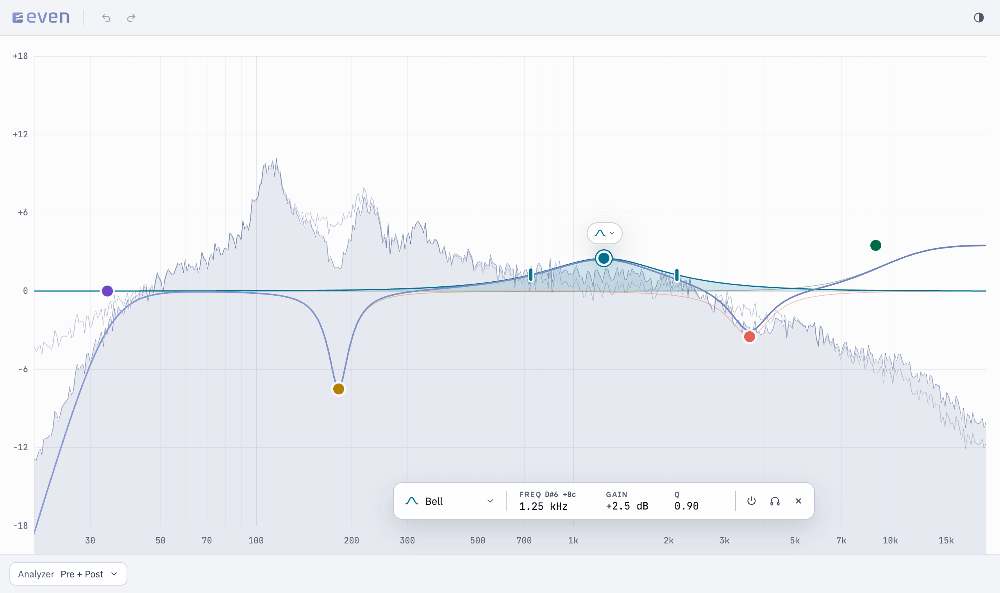

<h1>
  <picture>
    <source media="(prefers-color-scheme: dark)" srcset="media/even-logo-dark.svg">
    
  </picture>
</h1>

Even is a parametric EQ plug-in for macOS: up to 12 bands on a large frequency graph, with a real-time
spectrum analyzer behind the curve. Shape the sound by dragging points on the graph, listen to what a single
band does with solo, and step back through every edit with undo.

It runs as a VST3 plug-in in your DAW and as a standalone app.

Even is in early development. If you try it, feedback is welcome: please
[open an issue](https://github.com/egor-sm/even/issues).

<picture>
  <source media="(prefers-color-scheme: dark)" srcset="media/screenshot-dark.png">
  
</picture>

## Features

- **Up to 12 bands** of eight shapes: bell, low and high shelf, tilt shelf, low and high cut, notch and
  band pass.
- **Steep cuts**: low and high cuts from 6 to 96 dB/oct.
- **Wide ranges**: gain up to ±36 dB, Q from 0.1 to 30.
- **Spectrum analyzer** of the input, the output or both, drawn behind the EQ curve.
- **Solo** a band to hear only the frequency range it works on; **bypass** any band to compare.
- **Notes as well as hertz**: the frequency axis turns into a piano keyboard, and bands snap to notes.
- **Undo and redo** for every edit.
- **No clicks** while you edit or automate: parameters change smoothly, and switching a band's shape
  crossfades between the filters.
- **Automation**: every band parameter is available to your DAW.
- **Dark and light themes.**

## Install

1. Download `Even-<version>.pkg` from the [latest release](https://github.com/egor-sm/even/releases/latest).
2. Open it. The installer is not signed yet, so macOS stops it the first time: open
   **System Settings → Privacy & Security** and click **Open Anyway** next to the message about Even.
3. Choose what to install: the **VST3 plug-in** (into `/Library/Audio/Plug-Ins/VST3`), the **standalone app**
   (into `/Applications`), or both.
4. Restart your DAW or let it rescan plug-ins. Even appears among the VST3 effects.

**Requirements:** macOS 12 or later on Apple Silicon or Intel, and a DAW that loads VST3 plug-ins (such as
Ableton Live, Bitwig Studio, Cubase or Reaper). Logic Pro and GarageBand load only Audio Units, which Even does
not provide yet.

**Uninstall:** delete `/Library/Audio/Plug-Ins/VST3/Even.vst3` and `/Applications/Even.app`. Your theme choice is
kept in `~/Library/Application Support/Even`.

## Using Even

| To | Do |
|---|---|
| Add a band | Double-click an empty spot on the graph |
| Move a band | Drag its point: left and right for frequency, up and down for gain |
| Snap to notes | Hold Shift while dragging |
| Change the width (Q) | Scroll over the point, or drag the handles on the curve |
| Change the shape | Click the shape button above the selected point and pick one |
| Fine-tune values | Drag the frequency, gain or Q in the panel below the graph |
| Solo, bypass or delete a band | Use the buttons at the right of that panel |
| Zoom the gain scale | Drag or scroll the dB scale on the left; double-click it to fit all bands |
| Work in notes | Switch the frequency axis to ♫: click a key to move the selected band to that note, Alt-click to add a band there |
| Choose what the analyzer shows | Use the Analyzer menu at the bottom left |

## License

Even is free software under the [GNU General Public License v3.0](LICENSE).

To build it yourself or to contribute, see [CONTRIBUTING.md](CONTRIBUTING.md).
